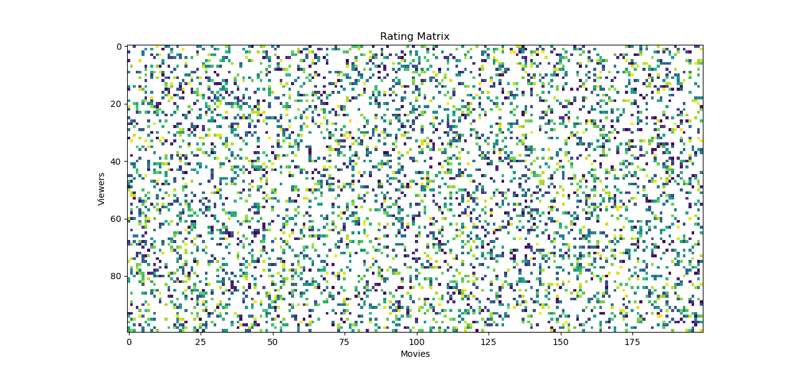

# Agent-Based-Recommendation

A project that uses agent based modeling in Python's [MESA](https://mesa.readthedocs.io/en/master/index.html) to generate ratings datasets that depend on personal preferences and preferences of your social network. The goal is to apply recommendation systems to the ratings dataset to see which methods best incorporate this additional information in predicting ratings of future user - item pairs.  

